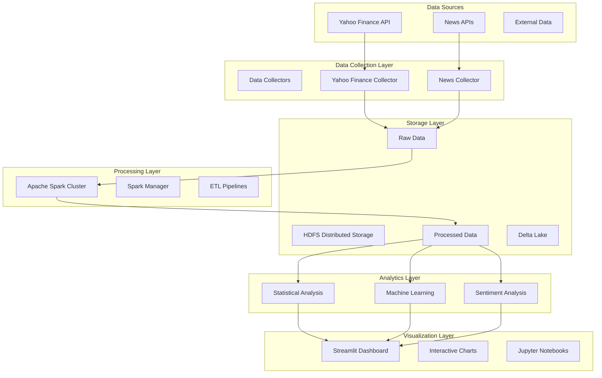

# Documentação Técnica - Projeto Big Data Finance

## 📋 Índice

1. [Arquitetura do Sistema](#arquitetura-do-sistema)
2. [Módulos e Componentes](#módulos-e-componentes)
3. [APIs e Interfaces](#apis-e-interfaces)
4. [Configurações](#configurações)
5. [Deployment](#deployment)
6. [Monitoramento](#monitoramento)
7. [Troubleshooting](#troubleshooting)

---

## 🏗️ Arquitetura do Sistema

### Visão Geral da Arquitetura



### Componentes Principais

#### 1. Data Collection Layer
- **Yahoo Finance Collector**: Coleta dados financeiros históricos e em tempo real
- **News Collector**: Coleta notícias e eventos mundiais
- **Rate Limiting**: Controle de taxa para APIs externas

#### 2. Storage Layer
- **HDFS**: Armazenamento distribuído para grandes volumes
- **Delta Lake**: Versionamento e ACID transactions
- **Particionamento**: Por data e símbolo para otimização

#### 3. Processing Layer
- **Apache Spark**: Processamento distribuído
- **ETL Pipelines**: Transformação e limpeza de dados
- **Feature Engineering**: Criação de features para ML

#### 4. Analytics Layer
- **Statistical Analysis**: Análises estatísticas avançadas
- **Machine Learning**: Modelos preditivos
- **Sentiment Analysis**: Análise de sentimentos de notícias

#### 5. Visualization Layer
- **Streamlit Dashboard**: Interface web interativa
- **Plotly Charts**: Gráficos interativos
- **Jupyter Notebooks**: Análises exploratórias

---

## 🔧 Módulos e Componentes

### 1. Data Collection (`src/data_collection/`)

#### YahooFinanceCollector
```python
class YahooFinanceCollector:
    """
    Coletor de dados financeiros do Yahoo Finance
    
    Funcionalidades:
    - Coleta de dados históricos (OHLCV)
    - Informações de empresas
    - Dados de índices e commodities
    - Rate limiting automático
    """
    
    def __init__(self, rate_limit: float = 1.0):
        self.rate_limit = rate_limit
        self.session = requests.Session()
    
    def collect_stock_data(self, symbols: List[str], 
                          start_date: str, 
                          end_date: str) -> pd.DataFrame:
        """Coleta dados de ações"""
        pass
    
    def collect_company_info(self, symbol: str) -> Dict:
        """Coleta informações da empresa"""
        pass
```

**Configurações:**
- Rate limiting: 1 request/segundo (configurável)
- Retry automático: 3 tentativas
- Cache local: 1 hora para dados históricos
- Formato de saída: Parquet com compressão snappy

#### NewsCollector
```python
class NewsCollector:
    """
    Coletor de notícias e eventos mundiais
    
    Funcionalidades:
    - Coleta de notícias históricas
    - Análise de sentimentos
    - Identificação de eventos relevantes
    - Enriquecimento de dados
    """
    
    def collect_historical_events(self, 
                                 start_date: str,
                                 end_date: str,
                                 keywords: List[str]) -> pd.DataFrame:
        """Coleta eventos históricos"""
        pass
```

### 2. Infrastructure (`src/infrastructure/`)

#### SparkManager
```python
class SparkManager:
    """
    Gerenciador do cluster Apache Spark
    
    Funcionalidades:
    - Criação de sessões Spark otimizadas
    - Processamento de dados financeiros
    - ETL pipelines
    - Integração com HDFS
    """
    
    def __init__(self, app_name: str = "BigDataFinance"):
        self.app_name = app_name
        self.spark = None
    
    def create_spark_session(self) -> SparkSession:
        """Cria sessão Spark otimizada"""
        pass
    
    def process_financial_data(self, 
                              input_path: str,
                              output_path: str) -> DataFrame:
        """Processa dados financeiros"""
        pass
```

**Configurações Spark:**
```conf
# spark-defaults.conf
spark.master=spark://spark-master:7077
spark.executor.memory=2g
spark.executor.cores=2
spark.sql.adaptive.enabled=true
spark.sql.adaptive.coalescePartitions.enabled=true
spark.serializer=org.apache.spark.serializer.KryoSerializer
spark.sql.extensions=io.delta.sql.DeltaSparkSessionExtension
```

#### HDFSManager
```python
class HDFSManager:
    """
    Gerenciador do HDFS
    
    Funcionalidades:
    - Upload/download de arquivos
    - Gerenciamento de diretórios
    - Monitoramento de espaço
    - Operações de limpeza
    """
    
    def __init__(self, namenode_url: str = "hdfs://namenode:9000"):
        self.namenode_url = namenode_url
        self.client = InsecureClient(namenode_url)
```

### 3. Data Analysis (`src/data_analysis/`)

#### StatisticalAnalyzer
```python
class StatisticalAnalyzer:
    """
    Análises estatísticas avançadas
    
    Funcionalidades:
    - Estatísticas descritivas
    - Testes de normalidade
    - Análise de correlação
    - Análise de volatilidade
    - Análise de séries temporais
    """
    
    def descriptive_statistics(self, data: pd.DataFrame) -> Dict:
        """Calcula estatísticas descritivas"""
        pass
    
    def test_normality(self, data: pd.Series) -> Dict:
        """Testa normalidade dos dados"""
        pass
```

#### ExploratoryAnalyzer
```python
class ExploratoryAnalyzer:
    """
    Análise exploratória de dados
    
    Funcionalidades:
    - Visualização de distribuições
    - Análise de missing values
    - Correlações
    - Outliers detection
    """
```

### 4. Machine Learning (`src/machine_learning/`)

#### SentimentAnalyzer
```python
class SentimentAnalyzer:
    """
    Análise de sentimentos
    
    Funcionalidades:
    - Análise com TextBlob e VADER
    - Sentiment financeiro especializado
    - Análise em lote
    - Correlação com preços
    """
    
    def analyze_sentiment_comprehensive(self, text: str) -> Dict:
        """Análise completa de sentimentos"""
        pass
```

#### PredictiveModels
```python
class PredictiveModels:
    """
    Modelos preditivos
    
    Funcionalidades:
    - Regressão (Linear, Ridge, Lasso, RF, GB, SVR)
    - Classificação (Logistic, RF, GB, SVC)
    - Feature engineering
    - Cross-validation temporal
    - Avaliação de modelos
    """
```

### 5. Visualization (`src/visualization/`)

#### FinancialDashboard
```python
class FinancialDashboard:
    """
    Dashboard financeiro interativo
    
    Funcionalidades:
    - Gráficos Plotly interativos
    - Interface Streamlit
    - Análise em tempo real
    - Exportação de relatórios
    """
```

#### FinancialCharts
```python
class FinancialCharts:
    """
    Gráficos financeiros especializados
    
    Funcionalidades:
    - Candlestick charts
    - Indicadores técnicos
    - Análise de volatilidade
    - Comparação multi-ativo
    """
```

---

## 🔌 APIs e Interfaces

### REST API Endpoints (Futuro)

```yaml
# API Specification
openapi: 3.0.0
info:
  title: BigData Finance API
  version: 1.0.0

paths:
  /api/v1/data/stocks/{symbol}:
    get:
      summary: Obter dados de ação
      parameters:
        - name: symbol
          in: path
          required: true
          schema:
            type: string
        - name: start_date
          in: query
          schema:
            type: string
            format: date
        - name: end_date
          in: query
          schema:
            type: string
            format: date
      responses:
        200:
          description: Dados da ação
          content:
            application/json:
              schema:
                $ref: '#/components/schemas/StockData'

  /api/v1/analysis/sentiment:
    post:
      summary: Análise de sentimentos
      requestBody:
        required: true
        content:
          application/json:
            schema:
              type: object
              properties:
                texts:
                  type: array
                  items:
                    type: string
      responses:
        200:
          description: Resultados da análise
```

### WebSocket Streams (Futuro)

```javascript
// Exemplo de conexão WebSocket
const ws = new WebSocket('ws://localhost:8000/ws/realtime');

ws.onmessage = function(event) {
    const data = JSON.parse(event.data);
    if (data.type === 'price_update') {
        updatePriceChart(data.symbol, data.price);
    }
};
```

---

## ⚙️ Configurações

### Environment Variables

```bash
# .env file
# APIs
NEWS_API_KEY=your_news_api_key
ALPHA_VANTAGE_KEY=your_alpha_vantage_key

# Spark
SPARK_MASTER_URL=spark://spark-master:7077
SPARK_DRIVER_MEMORY=2g
SPARK_EXECUTOR_MEMORY=2g
SPARK_EXECUTOR_CORES=2

# HDFS
HDFS_NAMENODE_URL=hdfs://namenode:9000
HDFS_REPLICATION_FACTOR=2

# Database
POSTGRES_HOST=postgres
POSTGRES_PORT=5432
POSTGRES_DB=bigdata_finance
POSTGRES_USER=postgres
POSTGRES_PASSWORD=password

# Monitoring
ENABLE_METRICS=true
METRICS_PORT=9090
LOG_LEVEL=INFO
```

### Docker Compose Configuration

```yaml
# docker-compose.yml
version: '3.8'

services:
  namenode:
    image: bde2020/hadoop-namenode:2.0.0-hadoop3.2.1-java8
    container_name: namenode
    restart: always
    ports:
      - 9870:9870
      - 9000:9000
    volumes:
      - hadoop_namenode:/hadoop/dfs/name
    environment:
      - CLUSTER_NAME=test
      - CORE_CONF_fs_defaultFS=hdfs://namenode:9000
    env_file:
      - ./docker/hadoop.env

  datanode:
    image: bde2020/hadoop-datanode:2.0.0-hadoop3.2.1-java8
    container_name: datanode
    restart: always
    volumes:
      - hadoop_datanode:/hadoop/dfs/data
    environment:
      SERVICE_PRECONDITION: "namenode:9870"
      CORE_CONF_fs_defaultFS: hdfs://namenode:9000
    ports:
      - "9864:9864"
    env_file:
      - ./docker/hadoop.env

  spark-master:
    image: bde2020/spark-master:3.4.0-hadoop3.3
    container_name: spark-master
    ports:
      - "8080:8080"
      - "7077:7077"
    environment:
      - INIT_DAEMON_STEP=setup_spark
      - CORE_CONF_fs_defaultFS=hdfs://namenode:9000
```

### Hadoop Configuration

```xml
<!-- core-site.xml -->
<configuration>
    <property>
        <name>fs.defaultFS</name>
        <value>hdfs://namenode:9000</value>
    </property>
    <property>
        <name>hadoop.http.staticuser.user</name>
        <value>root</value>
    </property>
</configuration>

<!-- hdfs-site.xml -->
<configuration>
    <property>
        <name>dfs.namenode.name.dir</name>
        <value>/hadoop/dfs/name</value>
    </property>
    <property>
        <name>dfs.datanode.data.dir</name>
        <value>/hadoop/dfs/data</value>
    </property>
    <property>
        <name>dfs.replication</name>
        <value>1</value>
    </property>
</configuration>
```

---

## 🚀 Deployment

### Local Development

```bash
# 1. Clone repository
git clone <repository-url>
cd ProjetoBigData

# 2. Setup environment
cp config/.env.example config/.env
# Edit .env with your configurations

# 3. Start services
docker-compose up -d

# 4. Verify services
docker-compose ps
curl http://localhost:8080  # Spark Master
curl http://localhost:9870  # HDFS NameNode
```

### Production Deployment

#### Docker Swarm
```bash
# Initialize swarm
docker swarm init

# Deploy stack
docker stack deploy -c docker-compose.prod.yml bigdata-finance

# Scale services
docker service scale bigdata-finance_spark-worker=3
```

#### Kubernetes (Futuro)
```yaml
# k8s-deployment.yaml
apiVersion: apps/v1
kind: Deployment
metadata:
  name: spark-master
spec:
  replicas: 1
  selector:
    matchLabels:
      app: spark-master
  template:
    metadata:
      labels:
        app: spark-master
    spec:
      containers:
      - name: spark-master
        image: bigdata-finance:latest
        ports:
        - containerPort: 8080
        - containerPort: 7077
```

### CI/CD Pipeline

```yaml
# .github/workflows/ci-cd.yml
name: CI/CD Pipeline

on:
  push:
    branches: [ main, develop ]
  pull_request:
    branches: [ main ]

jobs:
  test:
    runs-on: ubuntu-latest
    steps:
    - uses: actions/checkout@v2
    
    - name: Set up Python
      uses: actions/setup-python@v2
      with:
        python-version: 3.9
    
    - name: Install dependencies
      run: |
        pip install -r requirements.txt
        pip install pytest pytest-cov
    
    - name: Run tests
      run: |
        pytest tests/ --cov=src --cov-report=xml
    
    - name: Upload coverage
      uses: codecov/codecov-action@v1

  build:
    needs: test
    runs-on: ubuntu-latest
    steps:
    - uses: actions/checkout@v2
    
    - name: Build Docker image
      run: |
        docker build -t bigdata-finance:${{ github.sha }} .
        docker tag bigdata-finance:${{ github.sha }} bigdata-finance:latest
    
    - name: Push to registry
      run: |
        echo ${{ secrets.DOCKER_PASSWORD }} | docker login -u ${{ secrets.DOCKER_USERNAME }} --password-stdin
        docker push bigdata-finance:${{ github.sha }}
        docker push bigdata-finance:latest
```

---

## 📊 Monitoramento

### Métricas do Sistema

#### Spark Metrics
```python
# Custom Spark metrics
from pyspark.sql import SparkSession

def setup_spark_metrics(spark: SparkSession):
    """Configure Spark metrics"""
    spark.sparkContext.statusTracker()
    
    # Job metrics
    active_jobs = spark.sparkContext.statusTracker().getActiveJobIds()
    
    # Stage metrics
    active_stages = spark.sparkContext.statusTracker().getActiveStageIds()
    
    # Executor metrics
    executor_infos = spark.sparkContext.statusTracker().getExecutorInfos()
```

#### HDFS Metrics
```bash
# HDFS health check
hdfs dfsadmin -report

# Disk usage
hdfs dfs -du -h /

# File system check
hdfs fsck / -files -blocks -locations
```

#### Application Metrics
```python
# Custom application metrics
import time
import psutil
from typing import Dict

class MetricsCollector:
    """Coleta métricas da aplicação"""
    
    def collect_system_metrics(self) -> Dict:
        """Coleta métricas do sistema"""
        return {
            'cpu_percent': psutil.cpu_percent(),
            'memory_percent': psutil.virtual_memory().percent,
            'disk_usage': psutil.disk_usage('/').percent,
            'timestamp': time.time()
        }
    
    def collect_application_metrics(self) -> Dict:
        """Coleta métricas da aplicação"""
        return {
            'active_connections': len(self.get_active_connections()),
            'processed_records': self.get_processed_count(),
            'error_count': self.get_error_count(),
            'timestamp': time.time()
        }
```

### Logging Configuration

```python
# logging_config.py
import logging
import logging.config

LOGGING_CONFIG = {
    'version': 1,
    'disable_existing_loggers': False,
    'formatters': {
        'standard': {
            'format': '%(asctime)s [%(levelname)s] %(name)s: %(message)s'
        },
        'detailed': {
            'format': '%(asctime)s [%(levelname)s] %(name)s:%(lineno)d: %(message)s'
        }
    },
    'handlers': {
        'default': {
            'level': 'INFO',
            'formatter': 'standard',
            'class': 'logging.StreamHandler',
        },
        'file': {
            'level': 'DEBUG',
            'formatter': 'detailed',
            'class': 'logging.FileHandler',
            'filename': 'logs/application.log',
            'mode': 'a',
        },
    },
    'loggers': {
        '': {
            'handlers': ['default', 'file'],
            'level': 'DEBUG',
            'propagate': False
        }
    }
}

logging.config.dictConfig(LOGGING_CONFIG)
```

### Health Checks

```python
# health_checks.py
from typing import Dict, List
import requests
import subprocess

class HealthChecker:
    """Verificações de saúde do sistema"""
    
    def check_spark_master(self) -> bool:
        """Verifica se Spark Master está ativo"""
        try:
            response = requests.get('http://spark-master:8080', timeout=5)
            return response.status_code == 200
        except:
            return False
    
    def check_hdfs_namenode(self) -> bool:
        """Verifica se HDFS NameNode está ativo"""
        try:
            response = requests.get('http://namenode:9870', timeout=5)
            return response.status_code == 200
        except:
            return False
    
    def check_hdfs_health(self) -> Dict:
        """Verifica saúde do HDFS"""
        try:
            result = subprocess.run(
                ['hdfs', 'dfsadmin', '-report'],
                capture_output=True, text=True, timeout=10
            )
            return {
                'healthy': result.returncode == 0,
                'output': result.stdout
            }
        except:
            return {'healthy': False, 'output': 'Command failed'}
    
    def run_all_checks(self) -> Dict:
        """Executa todas as verificações"""
        return {
            'spark_master': self.check_spark_master(),
            'hdfs_namenode': self.check_hdfs_namenode(),
            'hdfs_health': self.check_hdfs_health(),
            'timestamp': time.time()
        }
```

---

## 🔧 Troubleshooting

### Problemas Comuns

#### 1. Spark Jobs Falhando

**Sintomas:**
- Jobs ficam em estado "FAILED"
- OutOfMemoryError nos logs
- Executors sendo removidos

**Soluções:**
```bash
# Aumentar memória dos executors
export SPARK_EXECUTOR_MEMORY=4g
export SPARK_DRIVER_MEMORY=2g

# Ajustar partições
spark.sql.adaptive.coalescePartitions.minPartitionNum=1
spark.sql.adaptive.coalescePartitions.initialPartitionNum=200

# Verificar logs
docker-compose logs spark-master
docker-compose logs spark-worker-1
```

#### 2. HDFS Não Acessível

**Sintomas:**
- "Connection refused" ao acessar HDFS
- NameNode em safe mode
- DataNodes não conectando

**Soluções:**
```bash
# Verificar status do cluster
docker-compose exec namenode hdfs dfsadmin -report

# Sair do safe mode
docker-compose exec namenode hdfs dfsadmin -safemode leave

# Verificar conectividade
docker-compose exec namenode hdfs dfs -ls /

# Recriar cluster (CUIDADO: apaga dados)
docker-compose down -v
docker-compose up -d
```

#### 3. Jupyter Notebooks Não Carregando

**Sintomas:**
- Timeout ao acessar Jupyter
- Kernels não iniciando
- Erro de permissões

**Soluções:**
```bash
# Verificar logs do Jupyter
docker-compose logs jupyter

# Verificar permissões
docker-compose exec jupyter ls -la /home/jovyan/work/

# Reiniciar container
docker-compose restart jupyter

# Acessar container diretamente
docker-compose exec jupyter bash
```

#### 4. Performance Issues

**Sintomas:**
- Processamento lento
- Alto uso de CPU/memória
- Timeouts frequentes

**Diagnóstico:**
```python
# Profiling de código
import cProfile
import pstats

def profile_function(func, *args, **kwargs):
    """Profile uma função"""
    profiler = cProfile.Profile()
    profiler.enable()
    result = func(*args, **kwargs)
    profiler.disable()
    
    stats = pstats.Stats(profiler)
    stats.sort_stats('cumulative')
    stats.print_stats(10)
    
    return result

# Monitoramento de recursos
import psutil

def monitor_resources():
    """Monitor recursos do sistema"""
    return {
        'cpu_percent': psutil.cpu_percent(interval=1),
        'memory': psutil.virtual_memory()._asdict(),
        'disk': psutil.disk_usage('/')._asdict()
    }
```

**Otimizações:**
```python
# Otimizações Spark
spark.conf.set("spark.sql.adaptive.enabled", "true")
spark.conf.set("spark.sql.adaptive.coalescePartitions.enabled", "true")
spark.conf.set("spark.sql.adaptive.skewJoin.enabled", "true")

# Cache de DataFrames frequentemente usados
df.cache()
df.count()  # Trigger cache

# Particionamento otimizado
df.repartition(col("date")).write.partitionBy("symbol").parquet(path)
```

### Logs e Debugging

#### Estrutura de Logs
```
logs/
├── application.log          # Logs da aplicação
├── spark/
│   ├── spark-master.log    # Logs do Spark Master
│   └── spark-worker.log    # Logs dos Workers
├── hadoop/
│   ├── namenode.log        # Logs do NameNode
│   └── datanode.log        # Logs do DataNode
└── jupyter/
    └── jupyter.log         # Logs do Jupyter
```

#### Debug Mode
```python
# Ativar debug mode
import logging
logging.basicConfig(level=logging.DEBUG)

# Debug específico para módulos
logging.getLogger('src.data_collection').setLevel(logging.DEBUG)
logging.getLogger('pyspark').setLevel(logging.INFO)
```

### Performance Tuning

#### Spark Tuning
```conf
# spark-defaults.conf para produção
spark.executor.memory=4g
spark.executor.cores=4
spark.executor.instances=10
spark.driver.memory=2g
spark.driver.maxResultSize=1g
spark.sql.adaptive.enabled=true
spark.sql.adaptive.coalescePartitions.enabled=true
spark.sql.adaptive.skewJoin.enabled=true
spark.sql.adaptive.localShuffleReader.enabled=true
```

#### HDFS Tuning
```xml
<!-- hdfs-site.xml para produção -->
<configuration>
    <property>
        <name>dfs.replication</name>
        <value>3</value>
    </property>
    <property>
        <name>dfs.block.size</name>
        <value>268435456</value> <!-- 256MB -->
    </property>
    <property>
        <name>dfs.namenode.handler.count</name>
        <value>100</value>
    </property>
</configuration>
```

---

## 📈 Métricas e KPIs

### Métricas de Performance
- **Throughput**: Registros processados por segundo
- **Latency**: Tempo de resposta das consultas
- **Resource Utilization**: CPU, memória, disco
- **Error Rate**: Taxa de erros por operação

### Métricas de Negócio
- **Data Freshness**: Idade dos dados mais recentes
- **Model Accuracy**: Precisão dos modelos ML
- **Coverage**: Cobertura de símbolos/mercados
- **Availability**: Uptime do sistema

### Alertas
```python
# Sistema de alertas
class AlertManager:
    def __init__(self):
        self.thresholds = {
            'cpu_usage': 80,
            'memory_usage': 85,
            'error_rate': 5,
            'data_delay': 300  # 5 minutes
        }
    
    def check_alerts(self, metrics: Dict):
        alerts = []
        
        if metrics['cpu_percent'] > self.thresholds['cpu_usage']:
            alerts.append(f"High CPU usage: {metrics['cpu_percent']}%")
        
        if metrics['error_rate'] > self.thresholds['error_rate']:
            alerts.append(f"High error rate: {metrics['error_rate']}%")
        
        return alerts
```

---

**Documentação mantida por: Fabio**  
**Última atualização: 2024**  
**Versão: 1.0**